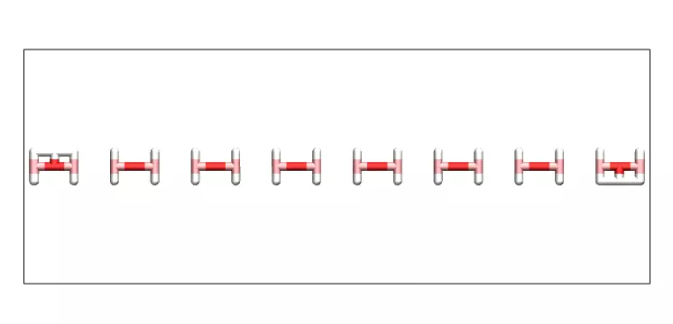

Pulling a PEG molecule in water
===============================

Here a single PEG molecule is immersed in water, and forces are applied to its
ends in order to extend it, as seen in this `video`_. This simulation was
inspired from this `article`_ by Liese et al.

.. _video: https://youtu.be/05DgPNfjReY
.. _article: https://doi.org/10.1021/acsnano.6b07071

The input files are described here. They are also available, together with all
required data and parameter files in this `folder`_.

.. _folder: files/

Creating a box of water
-----------------------

This script creates a parallelepiped rectangle box and fill it with
TIP4P/epsilon water molecules. The box is relaxed at ambient temperature
and pressure in the NPT ensemble.

Video showing water molecules being equilibrated in the NPT ensemble:

.. image:: files/pureH2O/water.webp
     :width: 600
     :alt: Water molecules being equilibrated in the NPT ensemble.

.. code-block:: python

     units real
     atom_style full
     bond_style harmonic
     angle_style charmm
     dihedral_style charmm
     pair_style lj/cut/tip4p/long 1 2 1 1 0.1546 12.0
     kspace_style pppm/tip4p 1.0e-4

Note: The atom_style `full` is required for charged molecules, and the pair_style `lj/cut/tip4p/long`
is a Lennard-Jones (cut) - Coulomb (long) pair style specifically adapted to 4 points water models,
which is what we want here.

.. code-block::

     region box block -40 40 -15 15 -15 15
     create_box 7 box &
     bond/types 6 &
     angle/types 9 &
     dihedral/types 14 &
     extra/bond/per/atom 2 &
     extra/angle/per/atom 1 &
     extra/special/per/atom 2

.. code-block::

     include ../PARM.lammps

.. code-block::

     molecule h2omol H2OTip4p.txt
     create_atoms 0 random 500 456415 NULL mol h2omol 454756
     group H2O type 1 2
     delete_atoms overlap 2 H2O H2O mol yes

.. code-block::

     fix myshk H2O shake 1.0e-4 200 0 b 1 a 1 mol h2omol
     fix mynpt all npt temp 300 300 100 iso 1 1 1000

.. code-block::

     dump mydmp all atom 1000 dump.lammpstrj
     variable mytemp equal temp
     variable myvol equal vol
     fix myat1 all ave/time 10 10 100 v_mytemp file temperature.dat
     fix myat2 all ave/time 10 10 100 v_myvol file volume.dat

.. code-block::

     timestep 1.0
     thermo 1000
     run 30000

.. code-block::

     write_data H2O.data

Creating a single PEG in vacuum
-------------------------------

The initial structure of the PEG molecule is extremely out-of equilibrium,
with all the atom placed in the same plane. An energy minimisation is required,
followed by a short NVT equilibration.

Anticipating the future merge, the box size is set to be
equal to the final water box (set in the Python script
generating the PEG molecule).

.. code-block:: python

     units real
     atom_style full
     bond_style harmonic
     angle_style charmm
     dihedral_style charmm
     pair_style lj/cut/tip4p/long 1 2 1 1 0.1546 12.0
     kspace_style pppm/tip4p 1.0e-4

.. code-block:: python

     special_bonds lj 0.0 0.0 0.5

*Comment -* The special_bonds command cancels the interactions between the
closest atoms of the molecule.

.. code-block:: python

     read_data init.data
     include ../PARM.lammps

.. code-block:: python

     group PEG type 3 4 5 6 7

.. code-block:: python

     dump mydmp all atom 10 dump.eq.lammpstrj
     thermo 1

.. code-block:: python

     minimize 1.0e-4 1.0e-6 100 1000
     undump mydmp
     reset_timestep 0

*Comment -* Minimisation of energy is required as the initial
configuration of the PEG molecule is far from an equilibrium value.
In addition, the high resolution dump command is cancelled at
the end of the minimisation, and a new lower resolution dump is created below.

.. code-block:: python

     fix mynve all nve
     fix myber all temp/berendsen 300 300 100

*Comment -* The PEG is equilibrated in the NVT ensemble. No box relaxation
is required as the PEG is in vacuum.

.. code-block:: python

     dump mydmp all atom 1000 dump.lammpstrj
     thermo 1000
     variable mytemp equal temp
     fix myat1 all ave/time 10 10 100 v_mytemp file temperature.dat

.. code-block:: python

     timestep 1
     run 10000

.. code-block:: python

     write_data PEG.data

Solvating the PEG in water
--------------------------

Video showing the PEG molecule in water. The system is equilibrated in
the NPT ensemble:

.. image:: files/mergePEGH2O/solvatedPEG.webp
     :width: 600
     :alt: PEG molecule in water.

.. code-block:: python

     units real
     atom_style full
     bond_style harmonic
     angle_style charmm
     dihedral_style charmm
     pair_style lj/cut/tip4p/long 1 2 1 1 0.1546 12.0
     kspace_style pppm/tip4p 1.0e-4

.. code-block:: python

     special_bonds lj 0.0 0.0 0.5

.. code-block:: python

     read_data ../singlePEG/PEG.data
     read_data ../pureH2O/H2O.data add append
     include ../PARM.lammps

.. code-block:: python

     group H2O type 1 2
     group PEG type 3 4 5 6 7

.. code-block:: python

     delete_atoms overlap 2.0 H2O PEG mol yes

.. code-block:: python

     fix myshk H2O shake 1.0e-4 200 0 b 1 a 1
     fix mynpt all npt temp 300 300 100 x 1 1 1000
     timestep 1.0

.. code-block:: python

     dump mydmp all atom 100 dump.lammpstrj
     thermo 100
     variable mytemp equal temp
     variable myvol equal vol
     fix myat1 all ave/time 10 10 100 v_mytemp file temperature.dat
     fix myat2 all ave/time 10 10 100 v_myvol file volume.dat

.. code-block:: python

     run 10000
     write_data mix.data

Pulling on the PEG
------------------

Video showing the PEG molecule being pulled in water.

.. image:: files/pullonPEG/pullonPEG.webp
     :width: 600
     :alt: PEG molecule being pulled in water.

.. code-block:: python

     variable f0 equal 2 # kcal/mol/A # 1 kcal/mol/A = 67.2 pN

*Comment -* The force is chosen to be large enough to overcome thermal agitation
and entropic contribution from both water and PEG molecules.

.. code-block:: python

     units real
     atom_style full
     bond_style harmonic
     angle_style charmm
     dihedral_style charmm
     pair_style lj/cut/tip4p/long 1 2 1 1 0.1546 12.0
     kspace_style pppm/tip4p 1.0e-4

.. code-block:: python

     special_bonds lj 0.0 0.0 0.5

.. code-block:: python

     read_data ../mergePEGH2O/mix.data
     include ../PARM.lammps

*Comment -* Simulation starts from the equilibrated PEG+water system.

.. code-block:: python

     group H2O type 1 2
     group PEG type 3 4 5 6 7
     group oxygen_end1 id 65
     group oxygen_end2 id 4

*Comment -* The two oxygen atoms located respectively at the two PEG ends
are selected and placed in groups on which the force will be applied.

.. code-block:: python

     dump mydmp all atom 1000 dump.lammpstrj
     # write_dump all atom dump.lammpstrj
     # dump myxtc xtc atom 1000 dump.xtc

*Comment -* To generate smaller dump files in compressed xtc format,
comment the mydmp line and uncomment both the write_dump and myxtc lines.
This is useful for generating higher resolution trajectories.

.. code-block:: python

     timestep 1
     fix myshk H2O shake 1.0e-4 200 0 b 1 a 1
     fix mynvt all nvt temp 300 300 100

.. code-block:: python

     variable mytemp equal temp
     fix myat1 all ave/time 10 10 100 v_mytemp file temperature.dat
     variable x1 equal xcm(oxygen_end1,x)
     variable x2 equal xcm(oxygen_end2,x)
     variable delta_x equal abs(v_x1-v_x2)
     fix myat2 all ave/time 10 10 100 v_delta_x file end-to-end-distance.dat
     thermo 10000

*Comment -* The distance between the two ends are here extracted directly using
the LAMMPS internal commands, but the same information can also be extracted
from the dump file after the simulation is over.

.. code-block:: python

     run 100000

*Comment -* First run

.. code-block:: python

     fix myaf1 oxygen_end1 addforce ${f0} 0 0
     fix myaf2 oxygen_end2 addforce -${f0} 0 0

.. code-block:: python

     run 200000

*Comment -* The forcing is applied only during the second part of the run.
