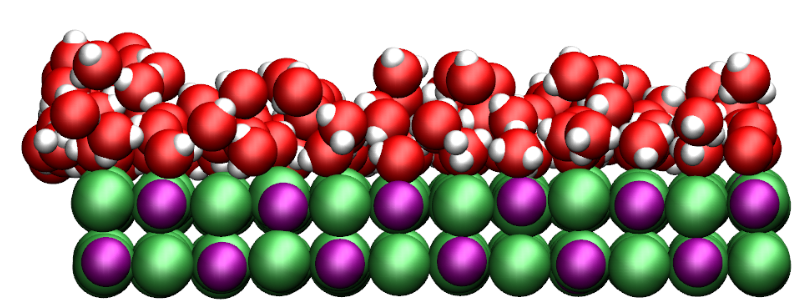

# How-to LAMMPS

This directory contains advanced LAMMPS input scripts with comments. 

### 1) [How to pull a PEG molecule in water](PEG-H2O/PEG-H2O.rst)

### 2) [How to measure the heat of adsorption](NaCl-H2O-GCMC/NaCl-H2O-GCMC.rst)

